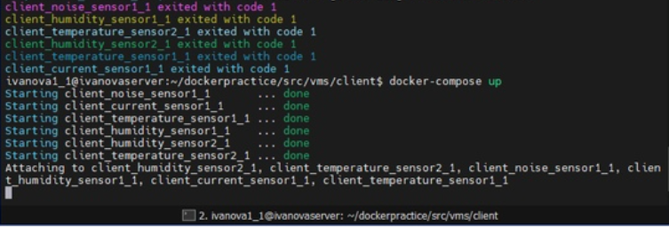
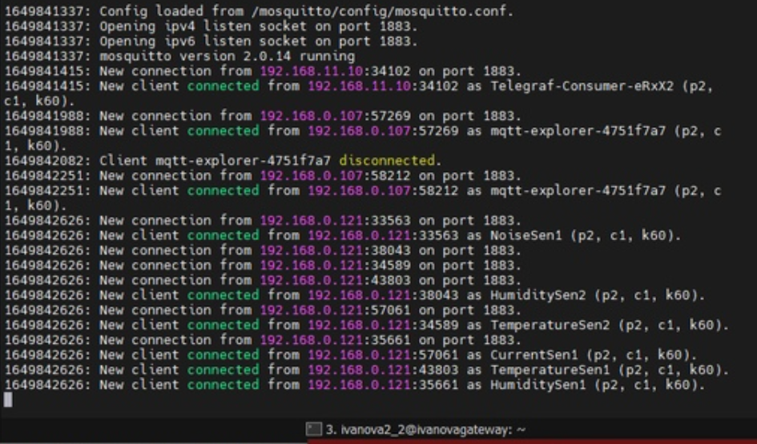
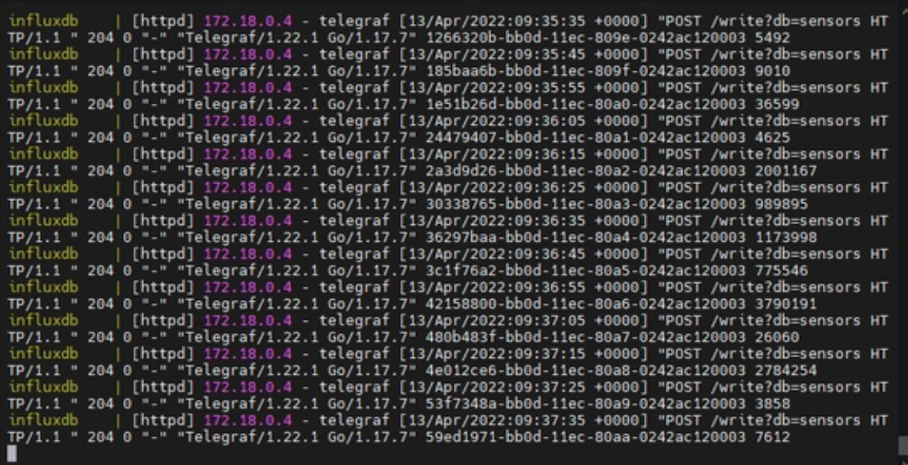
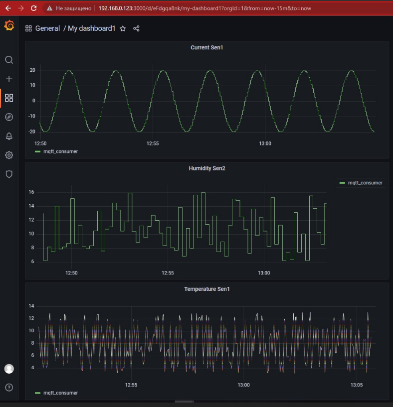
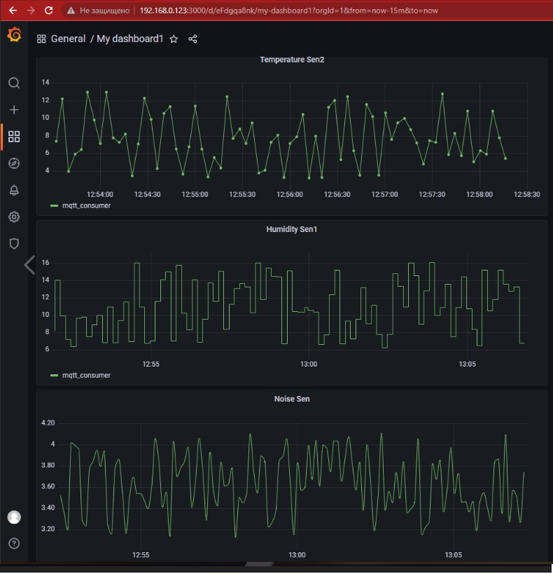

# Инструкция к работе

# Ubuntu A
Данная машина - client

Согласно заданию, был разработан симулятор технологических данных. Были указаны следующие датчики: температуры, тока, звука и влажности.

Сначала необходимо загрузить образ с помощью следующей команды:
```shell
sudo docker pull valery1080/mysensors:sen1
```
Затем необходимо сконфигурировать контейнер с помощью команды (в качестве IP адреса использовать IP вашего mqtt брокера, в моем случае 192.168.0.122):
```shell
docker run --rm -e TYPE=pressure -e MQTT_HOST=192.168.0.122 -e MQTT_PERIOD=5 -e COEFFICIENT=1 valery1080/mysensors:sen1
```
При работе с docker-compose необходиом указать датчики с желаемыми параметрами и MQTT_HOST=IP

Если контейнеры сконигурированы, то необходимо его запустить:
```shell
sudo docker-compose up
```
Лог машины А:


# Ubuntu B

Данная машина - gateway

На данной сначала необходиом настроить mqtt брокер путем загрузки образа eclipse-mosquitto:
```shell
sudo docker pull eclipse-mosquitto
```
Для запуска брокера на 1883 порту необходимо ввести команду:
```shell
docker run -v $PWD/mosquitto:/mosquitto/config -p 1883:1883 --name broker --rm eclipse-mosquitto
```
Лог машины B: 


# Ubuntu C

Данная машина - server

Сначала необходимо настроить telegraf. Для этого необходимо в конфигурационном файле заменить следующую строчку (с указанием в качестве IP адрес вашего брокера):
```shell
servers = ["tcp://192.168.11.1:1883"] # адрес vm с mqtt-брокером
```
Далее необходимо запустить docker-compose файл:
```shell
sudo docker-compose up
```
Лог машины C:


Таким образом были сконфигурированы контейнеры, а с помощью файла docker-compose сконфигурирована сеть.

В Grafana были получены следующие графики:


